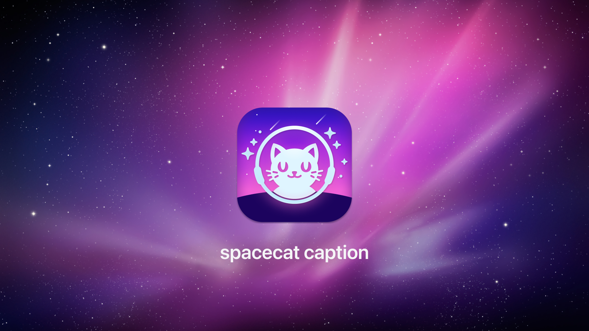
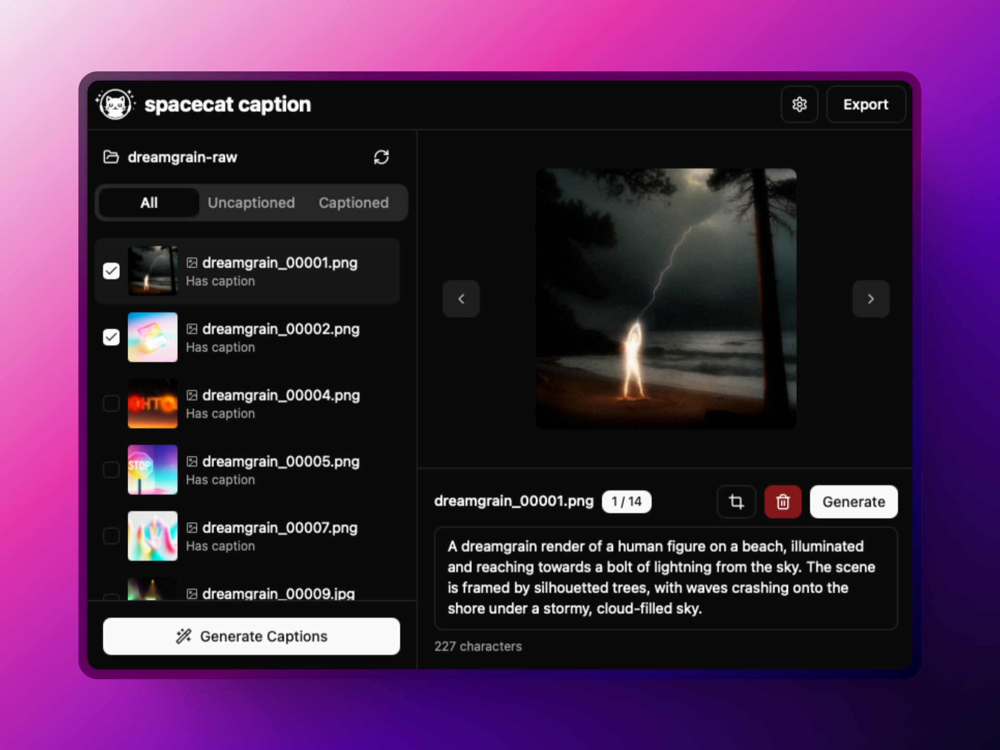

<p align="center">
    
<p>

# spacecat caption

A desktop application for generating and managing captions for images and videos using AI vision models. This is a Rust rewrite of [spacecat sage](https://github.com/markuryy/spacecat-sage), built with Tauri, React, and TypeScript.



## Features

- **AI-Powered Captions**: Generate descriptive captions for images and videos using OpenAI compatible vision models
- **Batch Processing**: Select multiple files to generate captions in bulk
- **File Management**: Organize and manage your media files with an intuitive interface
- **Caption Editing**: Manually edit AI-generated captions with a built-in editor
- **Image Cropping**: Crop images directly within the application
- **Video Processing**: 
  - Trim videos to specific time ranges
  - Crop videos to specific dimensions
  - Extract frames from videos for captioning
- **Project Management**: Create, save, and manage multiple captioning projects
- **Export Options**: Export your captioned media as a directory or ZIP file

## Screenshot



## Compared to spacecat sage

This is a simplified implementation compared to spacecat sage:

- **Direct filesystem** operations instead of SQLite database (pros: simpler, cons: potentially slower for large projects)
- **Simplified API configuration** focused primarily on OpenAI's API (the original prioritized JoyCaption via vLLM and other OpenAI-compatible APIs with built-in prompts)
- **More lightweight** overall with a smaller codebase

However, using the older `gpt-4o-2024-05-13` provides good enough support for human content, and you can still use JoyCaption if you want. The API implementation is the same interface (OpenAI-compatible), just requiring your own base URL when using your own models.

## Getting Started

### Prerequisites

- [FFmpeg](https://ffmpeg.org/) - Required for video processing functionality

### Platform Support

While the application is built with Tauri and should work cross-platform, official builds are only signed for:
- macOS (Intel and Apple Silicon)

For other platforms, you can run the development server instead of building the application.

### Installation

1. Download the latest release for macOS from the [Releases](https://github.com/markuryy/spacecat-caption/releases) page
2. Install the application using the provided installer or by extracting the archive

### Development Setup

1. Clone the repository
   ```
   git clone https://github.com/markuryy/spacecat-caption.git
   ```

2. Install dependencies
   ```
   cd spacecat-caption
   bun install
   ```

3. Run the development server
   ```
   bun run tauri dev
   ```

## Usage

### Setting Up

1. Open the application and click the gear icon to open Settings
2. Enter your OpenAI API key and configure other settings
3. Click the "Select Folder" button to choose a directory containing images and videos
4. The application will create a working copy of your files for safe editing

### Generating Captions

1. Select one or more files in the sidebar
2. Click "Generate Captions" to process all selected files
3. For individual files, select the file and use Shift+G or click the "Generate Caption" button

For videos, only the first or (rough) current frame is sent when captioning via API. Be sure to adjust your prompts accordingly, as the LLM can typically infer what occurs in a video from the first frame.

### Editing Media

1. Select an image or video in the sidebar
2. Use the crop or trim tools in the editor panel
3. Save your changes to update the file

### Saving Your Work

- Captions are automatically saved when modified
- Use the export button to save your project as a directory or ZIP file

## Configuration

### Settings

- **API URL**: The URL for the OpenAI API endpoint (default: https://api.openai.com/v1/chat/completions)
- **API Key**: Your OpenAI API key
- **Model**: The AI model to use (recommended: gpt-4o-2024-05-13 or gpt-4o)
- **Image Detail Level**: 
  - Auto: Let the model decide based on image size
  - Low: Uses a 512px x 512px version (85 tokens)
  - High: First uses low-res, then creates detailed crops (255 tokens)
- **Caption Prompt**: The prompt text to use when generating captions

### Keyboard Shortcuts

- **Shift + ←**: Navigate to previous image/video
- **Shift + →**: Navigate to next image/video
- **Shift + G**: Generate caption for current image/video

## Contributing

Contributions are welcome! Please feel free to submit a Pull Request.

## License

This project is licensed under the MIT License.

## Acknowledgments

- Built with [Tauri](https://tauri.app/), [React](https://reactjs.org/), and [TypeScript](https://www.typescriptlang.org/)
- Uses [OpenAI's API](https://openai.com/blog/openai-api) for AI-powered captioning
- FFmpeg for video processing functionality